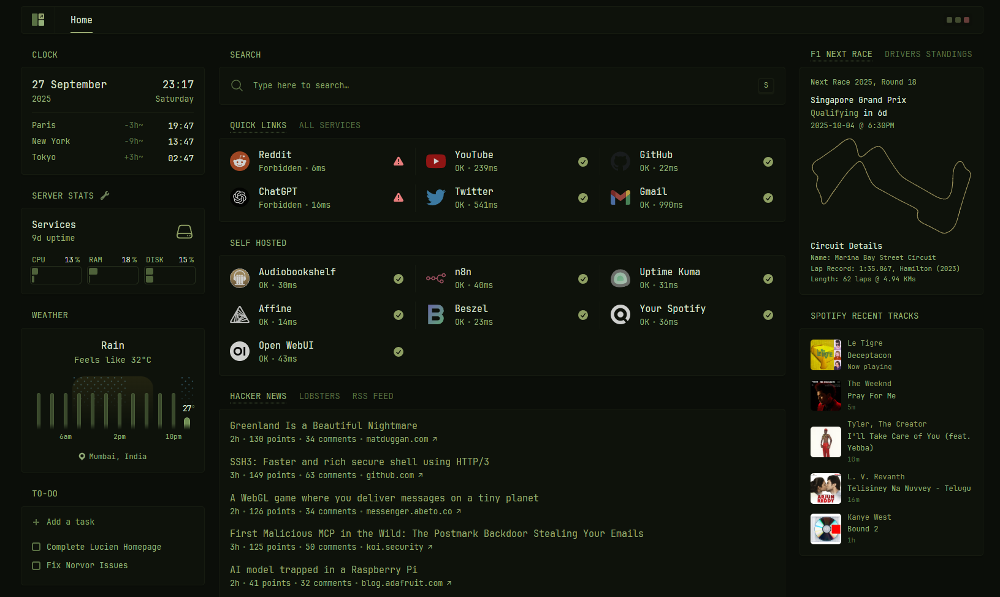

# Selfhost Infra with Docker

This repository contains my personal **Docker Compose setup** for self-hosting applications on a VPS.
It uses **Traefik** as a reverse proxy and **Authelia** for authentication.

The stack is modular — you can add or remove services as you like.

## Screenshots

### Glance Overview


---

## Prerequisites

- A VPS with Docker and Docker Compose installed
- Ports **80** and **443** open
- A domain or subdomains pointing to your VPS IP

  - Free domains from [DuckDNS](https://www.duckdns.org/) or [Afraid.org](https://afraid.org/) also work

- (Optional but recommended) Cloudflare for DNS — lets you use the included Cloudflare DDNS to automatically manage records

---

## Setup

### 1. Install Docker

```bash
curl -fsSL https://get.docker.com | sh
```

### 2. Clone this repository

```bash
cd /opt
git clone https://github.com/pawan67/selfhost-infra-docker.git
cd selfhost-infra-docker
```

### 3. Set proper permissions

You can change the permissions of the `/opt/selfhost-infra-docker` directory to your user using the following command:

```bash
sudo chown $(id -u):$(id -g) -R /opt/selfhost-infra-docker
```

This will allow you to edit files in the directory without needing to use `sudo`.

### 4. Configure environment variables

- Copy `.env.example` files into `.env` for each app you want to run
- Edit values with your domain, secrets, tokens, etc.

#### Using nano (command line):
```bash
nano apps/audiobookshelf/.env
```

#### Using VS Code (recommended):
```bash
# Install VS Code if not already installed
curl -fsSL https://code.visualstudio.com/sha/download?build=stable&os=linux-deb-x64 -o vscode.deb
sudo dpkg -i vscode.deb

# Open the project in VS Code
code /opt/selfhost-infra-docker
```

**VS Code Benefits:**
- Syntax highlighting for configuration files
- Easy file navigation
- Multiple files open in tabs
- Built-in terminal
- Extensions for Docker and YAML support

### 5. Start the core services (**Traefik** + **Authelia**)

```bash
docker compose --profile required up -d
```

### 6. Enable more services

- Add them to the `COMPOSE_PROFILES` variable in the root `.env`
- Or run them on demand with:

  ```bash
  docker compose --profile grafana --profile audiobookshelf up -d
  ```

### 7. Check your setup

- Make sure you're in the repo root (`pwd` should show `/opt/selfhost-infra-docker`)
- Run all enabled profiles:

  ```bash
  docker compose up -d
  ```

---

## 🐳 Docker Management

### Common Commands

#### View running containers
```bash
docker compose ps
```

#### View logs
```bash
# All services
docker compose logs

# Specific service
docker compose logs traefik

# Follow logs in real-time
docker compose logs -f authelia
```

#### Restart services
```bash
# Restart all services
docker compose restart

# Restart specific service
docker compose restart traefik

# Restart with profile
docker compose --profile grafana restart
```

#### Stop services
```bash
# Stop all services
docker compose stop

# Stop specific service
docker compose stop audiobookshelf

# Stop and remove containers
docker compose down
```

#### Update services
```bash
# Pull latest images
docker compose pull

# Restart with new images
docker compose up -d
```

#### Clean up
```bash
# Remove stopped containers, unused networks, and dangling images
docker system prune

# Remove unused volumes (be careful!)
docker volume prune
```

### Service Management

#### Add a new service
1. Enable the profile in your root `.env` file:
   ```bash
   COMPOSE_PROFILES=required,grafana,audiobookshelf,newservice
   ```
2. Start the new service:
   ```bash
   docker compose up -d
   ```

#### Remove a service
1. Stop and remove the service:
   ```bash
   docker compose stop servicename
   docker compose rm servicename
   ```
2. Remove from `COMPOSE_PROFILES` in `.env`

### Troubleshooting

#### Check service health
```bash
# View container status
docker compose ps

# Check specific service logs
docker compose logs servicename

# Enter container shell for debugging
docker compose exec servicename /bin/bash
# or
docker compose exec servicename /bin/sh
```

#### Resource usage
```bash
# View resource usage
docker stats

# View disk usage
docker system df
```

---

## 📝 Configuration Tips

### Editing Configuration Files

**Command Line:**
```bash
# Using nano
nano apps/service-name/.env

# Using vim
vim apps/service-name/.env
```

**VS Code (Recommended):**
- Install the Docker extension for better Docker Compose support
- Install the YAML extension for better syntax highlighting
- Use `Ctrl+Shift+P` → "Docker: Compose Up" for GUI management

### Environment Variables

Each service has its own `.env` file in `apps/{service-name}/`. Common variables include:
- `DOMAIN` - Your domain name
- `SUBDOMAIN` - Service subdomain
- `TIMEZONE` - Your timezone (e.g., `America/New_York`)
- `PUID` and `PGID` - User/Group IDs (run `id` to get yours)


---

## Notes
- Using Cloudflare DDNS is recommended check .env
- Some services need extra steps (like adding API keys or editing configs) — check their `README.md` inside `apps/{service}`
- Ports **80** and **443** must stay open
- Always run commands from the repository root directory (`/opt/selfhost-infra-docker`)
- Use `docker compose logs servicename` to troubleshoot issues
- Keep your `.env` files secure and never commit them to version control

---

## 🆘 Support

- Check individual service documentation in `apps/{service}/README.md`
- Review Docker Compose logs for error messages
- Ensure DNS records are properly configured
- Verify firewall settings allow ports 80 and 443